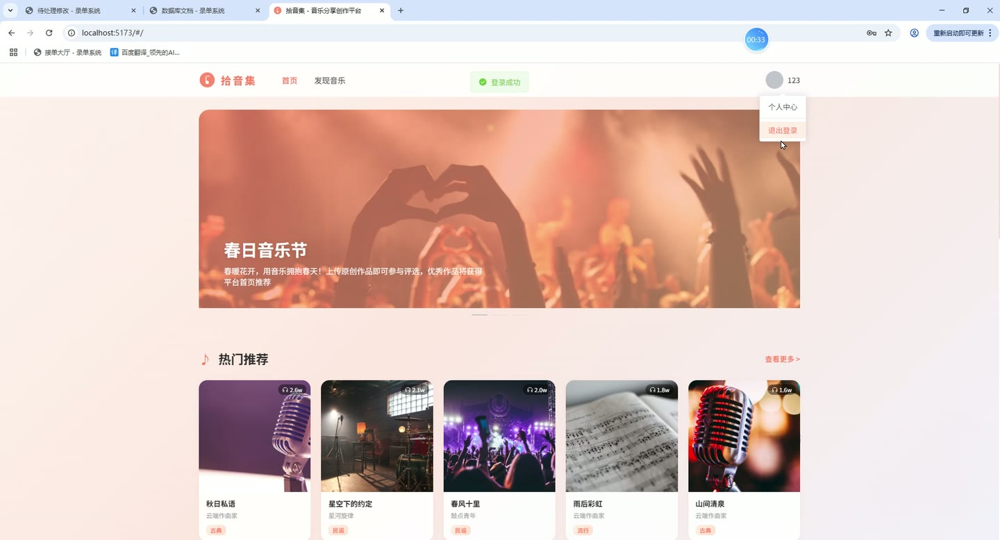
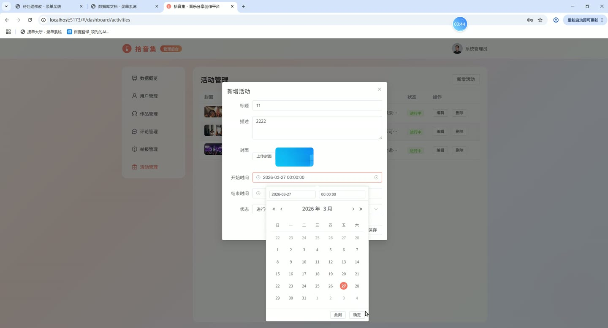
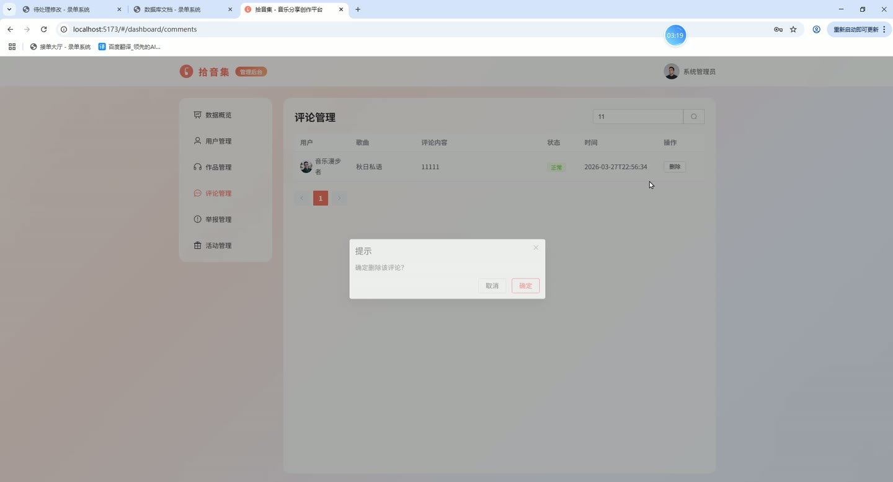
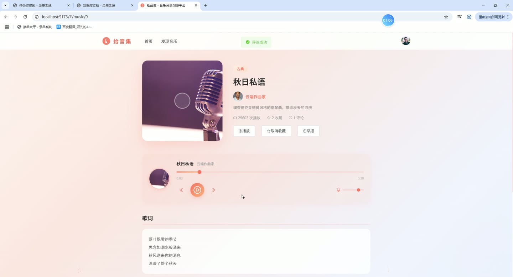
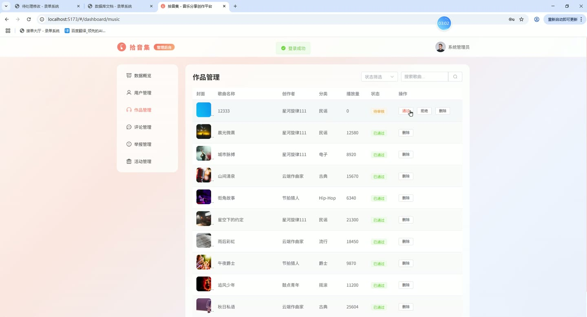

# (附文档)Springboot3+Vue3+MySQL 音乐分享创作网站

**技术栈**：Springboot3、Vue3、MySQL

### 系统简介

拾音集是一个基于 Spring Boot 3 + Vue 3 + MySQL 的原创音乐分享与创作平台。系统采用前后端分离架构，支持普通用户、创作者、管理员三种角色，提供音乐作品发布、多维度探索、社交互动、私信通知、后台数据统计与审核管理等完整功能。
 
### 核心功能
 
### 普通用户端

 
- 注册账号并选择角色（普通用户/创作者），支持用户名、密码、昵称、角色字段提交 
- 登录系统（支持密码 MD5 加密校验），自动根据角色跳转至首页/创作者面板/管理后台 
- 浏览首页推荐作品（按播放量降序取前 10 条已发布作品） 
- 查看最新作品列表（按创建时间降序取前 10 条已发布作品） 
- 进入作品详情页，查看作品封面、创作者头像昵称、分类、歌词、描述、播放量、收藏数和评论数 
- 播放作品（调用后端生成 WAV 音频流，支持 30 秒演示音频） 
- 收藏/取消收藏作品（toggle 接口，重复点击切换收藏状态） 
- 对作品发表评论（提交评论内容、关联作品 ID，状态默认为正常） 
- 关注/取消关注创作者（toggle 接口，支持检查是否已关注） 
- 查看关注列表与粉丝列表（展示用户昵称与头像） 
- 查看个人主页（展示头像、昵称、简介、邮箱、手机号、角色、关注数与粉丝数） 
- 编辑个人资料（修改头像、昵称、简介、邮箱、手机号） 
- 查看我的收藏列表（展示已收藏的音乐作品） 
- 查看我的关注列表（展示已关注的用户） 
- 发送私信给其他用户（填写接收者 ID 与内容，标记为未读） 
- 查看与某用户的聊天会话（按时间升序排列，自动将对方发来的未读消息标记为已读） 
- 查看联系人列表（按最近消息时间排序，展示最后一条消息） 
- 查看未读消息数量 
- 查看通知列表（按时间降序，支持单条标记已读和全部标记已读） 
- 查看未读通知数量 
- 举报作品或评论（提交举报类型、目标 ID、原因，状态为待处理） 
- 浏览探索页（按分类筛选作品，支持关键词搜索标题） 
- 查看创作者个人主页（展示创作者基本信息及其所有作品列表） 
- 查看活动列表（展示进行中的活动，包含标题、描述、封面、起止时间） 
- 退出登录（销毁服务端 Session）
 
### 创作者端

 
- 上传音乐作品（填写标题、分类、描述、歌词、上传封面图片和音频文件） 
- 管理我的作品列表（查看所有已发布/待审核/已拒绝作品，支持按状态筛选） 
- 编辑已上传的作品信息（修改标题、分类、描述、歌词、封面等字段） 
- 删除自己的作品 
- 查看作品统计（作品总数、已发布数量、总播放量、总收藏数、总评论数） 
- 查看作品的互动数据（评论列表，含用户头像昵称、评论内容、时间） 
- 编辑个人创作者资料（修改头像、昵称、简介、邮箱、手机号） 
- 查看未读消息与通知 
- 发送与接收私信
 
### 管理员端

 
- 查看数据概览仪表盘（展示注册用户数、创作者数、已发布作品数、待审核作品数、总播放量、评论数、收藏数、待处理举报数） 
- 用户管理：查看用户列表（支持按昵称/用户名搜索，分页展示） 
- 用户管理：启用/禁用用户账号（toggle 状态，禁用后无法登录） 
- 用户管理：重置用户密码为 123456（MD5 加密） 
- 作品管理：查看所有作品列表（支持按状态筛选和关键词搜索标题） 
- 作品管理：审核作品（通过/拒绝，更新作品状态字段） 
- 作品管理：删除违规作品 
- 评论管理：查看所有评论列表（支持关键词搜索内容，展示用户头像昵称、歌曲名称） 
- 评论管理：删除评论（软删除，将状态置为 0） 
- 举报管理：查看举报列表（支持按状态筛选待处理/已处理） 
- 举报管理：处理举报（标记为已处理并记录处理时间） 
- 活动管理：新增活动（填写标题、描述、封面、起止时间、状态） 
- 活动管理：编辑活动信息 
- 活动管理：删除活动 
- 支持快速登录体验（管理员/创作者/普通用户一键登录）
 
### 技术栈

 后端框架Spring Boot 3.x ORMMyBatis-Plus（含分页插件与自动填充） 权限基于 HttpSession 的登录校验 前端框架Vue 3（Composition API + script setup） 状态管理Pinia（userStore） 构建工具Vite 数据库MySQL 8.x 前端组件库Element Plus 路由Vue Router（Hash 模式） HTTP 客户端Axios 密码加密Hutool MD5 文件上传MultipartFile + 本地存储 跨域CORS 全局过滤器
 
### 交付内容

 
- 后端完整源码 
- 前端完整源码 
- 数据库初始化脚本 
- 万字文档

## 界面展示

---

## 获取完整源码 + 万字文档

本仓库为项目介绍页。**完整前后端源码、数据库初始化脚本、万字项目文档**，请加微信 `kangkangcode`，或访问 [codekk.top](http://codekk.top) 获取。

可作课程设计 / 毕业设计参考，支持远程部署调试。